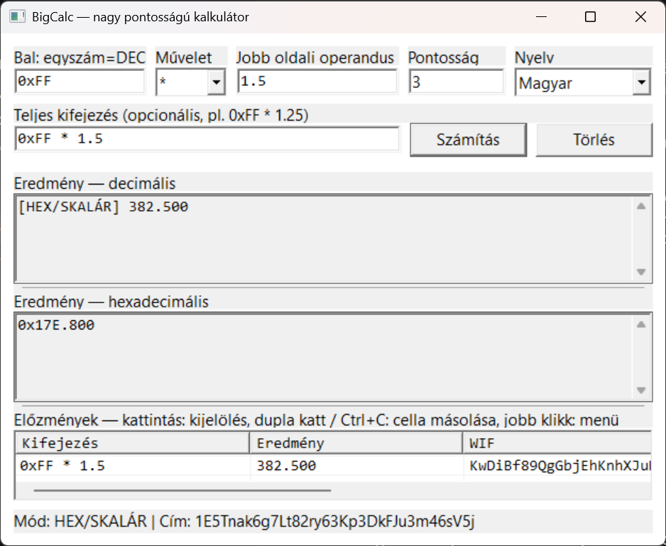

# BigCalc GUI

Nagy pontosságú kalkulátor secp256k1 kulcsokkal való munkához: fixpontos decimális/hexadecimális nagyszám-kalkulátor, elliptikus görbe pont-aritmetika, egy nyers erős `Start + k·G = Cél` lépésszámláló (Range-Count), és Bitcoin WIF/cím-származtatás — mindez egyetlen kis asztali programban. Linuxon natív Qt6 GUI-val (`main.cpp`), Windowson natív Win32 GUI-val (`main_win32.cpp`) fut, ugyanazt a külső függőség nélküli kalkulátor/kripto magot használva mindkettő.

*[English description → README.md](README.md)*



## Funkciók

- **Fixpontos nagyszám-kalkulátor** — tetszőleges pontosságú decimális és hexadecimális aritmetika (`+ - * /`), állítható tizedesjegy-szám, vegyes hex/decimális kifejezések, pl. `0xFF * 1.5`.
- **Görbe mód ("G-mód")** — ugyanaz a beviteli mező secp256k1 pontokat is elfogad (`02…`/`03…` compressed, `04…` uncompressed, vagy `G` a generátorra). Támogatja a pont `+`, pont `-` (`P1 + (-P2)`), skalárral szorzás (`k*P`) és skalárral osztás (`P/k = (k⁻¹ mod n)·P`) műveleteket.
- **Range-Count** — a `CélPont / StartPont` bejárja a `Start + G, +G, +G, …` sorozatot, amíg el nem éri a Célt (vagy el nem éri az állítható lépéslimitet), és megadja a pontos lépésszámot. Ez egy valódi (bár nyers erős) diszkrét-logaritmus-keresés lépésenként — kis, ismert eltolások ellenőrzésére jó két pont között, nem korlátlan kulcstér átfésülésére.
- **Bitcoin kulcs-származtatás** — minden skalár vagy görbe-eredményhez automatikusan előáll a compressed pubkey, a P2PKH cím, és (ha van hozzá privát kulcs) a WIF is. A SHA-256, RIPEMD-160 és Base58Check saját implementáció, nincs külső kriptó-könyvtár.
- **Előzmények panel** — minden számítás naplózva van kifejezéssel, eredménnyel, WIF-fel, pubkey-vel és címmel; kattintással kijelölhető, dupla katt vagy `Ctrl+C` másolja a cellát, jobb klikkre cella/sor másoló menü jelenik meg.
- **Magyar / angol / német felület** — a jobb felső sarokban lévő legördülőből azonnal válthatsz nyelvet; a választás megjegyződik az exe mellett.
- **Három vizuális téma (Linux/Qt6 build)** — a nyelv-váltó melletti "Megjelenés" legördülőből azonnal váltható; a választás a `bigcalc_theme.ini`-ben megjegyződik az exe mellett:
  - **Terminál / Crypto Dark** — foszfor-zöld monospace terminál hangulat (JetBrains Mono mindenhol).
  - **Modern Világos Dashboard** — letisztult fehér kártyák, indigó akcentus (Manrope + IBM Plex Mono).
  - **Dark Fintech / Exchange** — prémium sötét navy arany akcentussal (Space Grotesk + IBM Plex Mono).
- **Minimális függőség** — a kalkulátor/kripto mag külső függőség nélküli; a GUI réteg Linuxon Qt6 Widgets-et, Windowson sima Win32 API-t használ.

## Fordítás

### Linux / Ubuntu (Qt6)

Szükséges hozzá a Qt6 Widgets fejlesztői csomag:

```bash
sudo apt install qt6-base-dev cmake build-essential
./build.sh
```

ez elkészíti a `build/BigCalc`-ot. A `build.sh` csak becsomagolja a `cmake` + `cmake --build` hívásokat (lásd `CMakeLists.txt`).

### Windows (Win32)

Szükséges hozzá az [MSYS2](https://www.msys2.org/) a `mingw-w64-x86_64-gcc` toolchain-nel (`g++`), a `C:\msys64\mingw64` alá telepítve.

```bat
build.bat
```

ez elkészíti a `BigCalc.exe`-t. A fordítás egyetlen `g++` hívás (lásd `build.bat`) — nincs CMake, nincs projektfájl.

### Önteszt futtatása

Három kis konzolos program ellenőrzi a kalkulátor magját és a Bitcoin kulcs-származtatást ismert, helyes vektorokkal (köztük a jól ismert `k=1` → `1BgGZ9tcN4rm9KBzDn7KprQz87SZ26SAMH` teszt-vektorral):

```bat
g++ -std=c++17 -O2 -I. test_calc.cpp -o test_calc.exe
g++ -std=c++17 -O2 -I. test_btc.cpp crypto/BitcoinCrypto.cpp crypto/SecpAffine.cpp -o test_btc.exe
g++ -std=c++17 -O2 -I. test_btc_vectors.cpp crypto/BitcoinCrypto.cpp crypto/SecpAffine.cpp -o test_btc_vectors.exe
```

## Használat

Írj be egy kifejezést a **Teljes kifejezés** mezőbe, vagy töltsd ki a **Bal / Művelet / Jobb** mezőket, majd nyomd meg a **Számítás** gombot:

| Bemenet | Mit csinál |
|---|---|
| `0xFF * 1.5` | Fixpontos kalkulátor, `382.500` |
| `5 * G` | Skalárral szorzás → az `5·G` pubkey (és a WIF/cím is, mivel `5` érvényes privát kulcs) |
| `<pubkey> / <start-pubkey>` | Range-Count: hány `+G` lépés kell a Starttól a cél pubkey eléréséhez |
| `<pubkey> / 3` | `(3⁻¹ mod n) · pubkey` |

A **Decimális** és **Hexadecimális** eredmény panel a nyers számot vagy pont-eredményt mutatja; az **Előzmények** táblázat mindig megpróbálja a WIF-et / compressed pubkey-t / P2PKH címet is előállítani, ha az eredmény érvényes skalár vagy pont.

## Licenc

[MIT](LICENSE)
